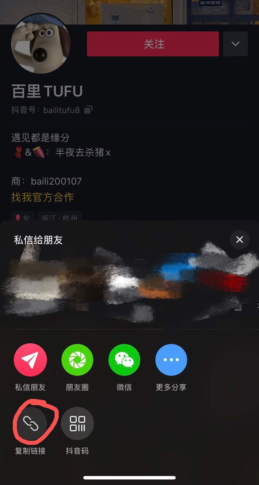
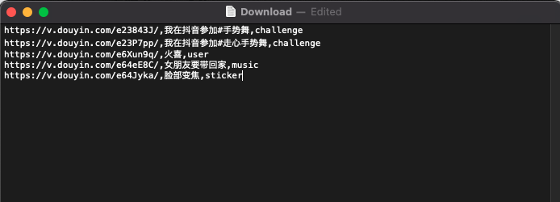

# Download Tiktok Videos 
Download Tiktok videos from shared url. 

Please **Don't** use the shared url from the **Tiktok extreme Edition**:
 

Just use the **normal Tiktok version**:


## Overview
It's a python script, 
use the shared url to download different type video from Tiktok
(Now we support challenge/user/sticker/music),save the download log 
and upload the downloaded video to boss.


## Content
- [Prerequisites](#prerequisites)
  * [Libraries](#libraries)
  * [Download txt](#Download txt)
- [Usage](#usage)
- [To be improved](#To be improved)


## Prerequisites
### Libraries
The code is built with following libraries:

- [requests](https://docs.python-requests.org/en/master/user/install/#install)
- [urllib3](https://urllib3.readthedocs.io/en/latest/)
- [json](https://www.json.org/json-en.html)
- [csv](https://docs.python.org/3/library/csv.html)

If you don't want to install all the packages one by one ,direct use the requirement.txt.
- [requirement.txt](requirements.txt)


### Download txt
1. Get the shared url from Tiktok
   
   E.g User:
   
2. Creat the download.txt 
   
   You should provide three variables for every url
   1. Shared url 
   2. Video dir name
   3. Video type
   
      

##Usage
Assume you have already installed all **Required Packages** 
and created the *Download.txt* file.

Normal:
```
python -m main --output-path /user/jan/video_path --json-path /user/jan/json_path --text-path /user/jan/you_created_download_txt.txt
```
If you have already downloaded all the json and want to 
download the video direct from the json file
```
python -m main --output-path /user/jan/video_path --json-path /user/jan/json_path --text-path /user/jan/you_created_download_txt.txt --direct-download yes
```

##To be improved
1. Proxy:

    Use dynamic Ip pool (Improve speed and avoid being locked Ip)
2. Design logic:

    Because of Network status or Storage medium 
   sometimes the download process will be interrupted. 
   In our script it will request the url a second time to scan throw the already json file
   it costs a lot and increase the Risk of being Blocked.
